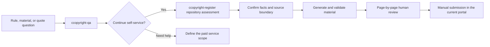

<div align="center">

# Software Copyright Self-Service Toolkit

> **Understand the rules first. Build the materials with confidence.**

[](https://agentskills.io)
[](README.md)
[](#safety-and-scope)

Rules scattered across legislation, service guides, and the authenticated portal?<br>
Unsure what a service quote actually buys?<br>
Already have a code repository, but not a traceable, reviewable material package?

[Choose a Skill](#two-skills-one-path) · [One-minute install](#one-minute-install) · [First use](#first-use) · [From input to result](#from-input-to-result) · [Safety](#safety-and-scope)

**Ordinary deposit** · **Manual submission** · **Privacy first** · **No legal conclusions**

</div>

---

## Why this project exists

Software copyright registration should not depend on guesswork, and fragmented public information should not force an applicant to buy a service they cannot evaluate.

This project separates “understand first” from “prepare next” into two independently installable Agent Skills: one provides source-aware, read-only Q&A; the other turns a real code repository into reviewable materials. The goal is to reduce information asymmetry by making four things visible before you choose self-service or paid help:

| Find the basis | Understand the service | Build the materials | Know when to stop |
|---|---|---|---|
| Separate rules, service guidance, current portal behavior, and third-party claims | See the actual work and conditions behind a service fee | Generate traceable, human-reviewable material from a real repository | Leave ownership, contract, and special-deposit issues to qualified specialists |

This does not mean third-party services lack value. Organization, drafting, formatting, data entry, and human communication can involve real work. The toolkit helps you distinguish official work, work you can perform, actual paid deliverables, and issues that still require specialist judgment.

Both Skills support understanding and preparation before manual handling with the [China Copyright Protection Center](https://www.ccopyright.com.cn/). They do not sign in, fill or submit browser forms, track applications, or interpret correction notices.

## Two Skills, one path

| | **ccopyright-qa** | **ccopyright-register** |
|---|---|---|
| Solves | Rules, fields, materials, self-service decisions, redacted quotes | Repository assessment, fact worksheets, source/document material, PDF validation |
| Default behavior | Read-only answer with source, date, conditions, and unknowns | Assess read-only, then write only inside `.ccopyright/` after approval |
| Writes files | Never | Yes, but never silently changes product source |
| Local dependencies | No Python, Chrome, or Poppler for ordinary use | Python required; Chrome and Poppler for the PDF workflow |
| Typical opening | “Can the short name be blank?” “Do I need an agency?” | “Assess this repository.” “Generate source, manual, and PDFs.” |

The shortest decision rule:

- **You only need an answer**: install **ccopyright-qa**.
- **You need repository work**: install **ccopyright-register**.
- **You are not sure yet**: install both and start with Q&A.

```text
Question → ccopyright-qa → self-service/paid-help decision → ccopyright-register → human review → current portal
```

## One-minute install

### Recommended: install both Skills

```bash
npx skills add OtterPaw-Studio/ccopyright-skill \
  --skill ccopyright-qa ccopyright-register
```

### Install only one

```bash
# Read-only Q&A
npx skills add OtterPaw-Studio/ccopyright-skill --skill ccopyright-qa

# Material preparation
npx skills add OtterPaw-Studio/ccopyright-skill --skill ccopyright-register
```

### Install globally for Codex

```bash
npx skills add OtterPaw-Studio/ccopyright-skill \
  --skill ccopyright-qa ccopyright-register \
  --agent codex \
  --global
```

From a local checkout:

```bash
npx skills add . --skill ccopyright-qa ccopyright-register
```

The **skills** CLI runs through **npx**. See the [skills.sh CLI documentation](https://www.skills.sh/docs/cli) for installation, updates, removal, and anonymous install statistics. To opt out for one installation:

```bash
DISABLE_TELEMETRY=1 npx skills add OtterPaw-Studio/ccopyright-skill \
  --skill ccopyright-qa ccopyright-register
```

## First use

There is no fixed command language. Copy the prompt closest to your current goal.

### Ask about the rules without generating files

```text
Use $ccopyright-qa to explain the materials normally needed for ordinary China
software copyright registration. Separate the legal baseline, current portal
details I still need to verify, and work I can perform myself.
```

### Assess the repository without generating material

```text
Use $ccopyright-register to assess this repository for ordinary China software
copyright registration. Do not generate materials yet. Show the candidate
software identity, source boundary, missing facts, and every warning.
```

### Start a draft directly

```text
Use $ccopyright-register to prepare registration materials for this repository.
Explain the write scope, create the .ccopyright workspace, generate a draft,
and ask only for facts the repository cannot safely establish.
```

### Break down a service quote

```text
Use $ccopyright-qa to break down this service quote after I have removed
identity, order, and payment information. Identify each deliverable, work I
still need to do, and questions I should ask the provider.
```

Registration-facing worksheets and identification material use Chinese by default.

## Prerequisites

| Requirement | **ccopyright-qa** | **ccopyright-register** |
|---|:---:|:---:|
| Agent Skills-compatible AI agent | Required | Required |
| Node.js with **npx** | Installation only | Installation only |
| Access to current official pages | For current-state questions | To confirm current portal requirements |
| Python 3.10+, available as **python** | Not needed | Required |
| Chrome or Chromium | Not needed | For PDF generation |
| Poppler | Not needed | For PDF validation and contact sheets |
| Git | Not needed | Recommended, not required |

The Q&A Skill needs no repository, portal account, or local generation tools. Without PDF tools, the preparation Skill can still scan a repository and create fact worksheets, Markdown, and HTML.

Ask **ccopyright-register** to run its preflight, or run this in its installed directory:

```bash
python scripts/ccopyright.py preflight
```

The local generator needs no additional LLM API key, portal password, identity document, or signing certificate.

## From input to result



| Stage | What you provide | What the Skill returns |
|---|---|---|
| Understand | A rule, field, material, or quote question | Direct answer, evidence class and date, conditions, unknowns, and next step |
| Assess | The code repository | Source/document inventory, candidate boundary, evidence map, and **INFO/WARNING** precheck |
| Confirm | Applicant facts that code cannot prove | Schema-v3 canonical facts and unresolved-item checklist |
| Generate | Confirmed source order and document content | Form worksheet, program/document material, proof-readiness checklist, and traceability |
| Validate | Current portal constraints and confirmations | A4 PDFs, pagination/hash/field checks, page images, and contact sheets |
| Review | Page-by-page approval | A timestamped `ready-to-submit` revision without overwriting earlier work |

### Material workspace

**ccopyright-register** creates this workspace in the target repository:

```text
.ccopyright/
├── facts/                 canonical application facts and requirement snapshot
├── reports/               inventory, precheck, evidence, build, render reports
├── drafts/                copy-ready worksheet and human checklists
├── work/                  Markdown, HTML, PDFs, assets, and traceability manifests
├── qa/                    validation reports, page PNGs, and contact sheet
└── ready-to-submit/       immutable timestamped reviewed revisions
```

Program material is built from explicitly selected first-party files while preserving original blank lines, comments, tabs, content, and order. Every printed row maps to its original path, line number, stream position, and hash. Document material uses applicant-approved documentation, repository evidence, and real product screenshots; missing evidence produces a warning rather than invented functionality.

Full guides: [material preparation](skills/ccopyright-register/README.en.md) · [read-only Q&A](skills/ccopyright-qa/README.en.md)

## Sources, quotes, and uncertainty

**ccopyright-qa** distinguishes four basis classes:

1. official legislation, regulation, or rule;
2. a specific China Copyright Protection Center guide or FAQ with access date;
3. current redacted portal text explicitly reviewed for this application;
4. material establishing only a third party's own claim, or a clearly labeled inference or practice suggestion.

Current fees, channels, fields, upload limits, processing times, and provider prices must not be answered from memory. When a current source does not support the value, the Skill marks it unverified.

A user-supplied quote remains case evidence rather than a current market price. The project does not label a price “fair,” “unfair,” or “a scam” without defined scope and evidence. It separates official work, self-service work, provider deliverables, promise conditions, and issues genuinely requiring specialist judgment.

The preparation Skill's fields, conditional branches, and character gates are an updateable portal-compatibility profile—not Q&A evidence and not a permanent official rule.

## Safety and scope

Neither Skill:

- fills or submits a browser form;
- logs in, signs, pays, or operates an applicant account;
- tracks an application or parses correction notices;
- determines ownership or contract enforceability or guarantees registration;
- stores identity numbers or scans, signatures, credentials, payment data, or session data;
- automates exceptional deposit, sealing, classified, or military workflows.

**ccopyright-qa** is read-only and does not scan repositories or generate files. **ccopyright-register** explains its write scope and obtains approval before using `.ccopyright/`; it never silently changes product source. Answers and outputs are informational and preparatory assistance, not legal advice.

Repository, ownership, and IP prechecks use exactly **INFO** and **WARNING** to prompt human review, not to make legal conclusions. Current portal constraints, required facts, ordinary-deposit selection, and PDF validation remain final-stage gates.

## Managing installed Skills

```bash
# List
npx skills list
npx skills list --global

# Update
npx skills update ccopyright-qa ccopyright-register

# Remove
npx skills remove ccopyright-qa ccopyright-register
```

## FAQ

### Which Skill should I install first?

Install **ccopyright-qa** for questions or to decide whether to buy assistance. Install **ccopyright-register** when you need repository material work. Install both when unsure.

### Are Q&A answers guaranteed to be current?

No. Rules can be amended, and service pages and authenticated portal behavior can change. Re-check the specific official page and current portal for fees, forms, channels, timelines, and upload constraints; the configured validation profile does not replace that check.

### Can I generate material without Chrome or Poppler?

Repository assessment, fact worksheets, traceability, Markdown, and HTML remain available. PDF rendering and technical validation require the corresponding tools.

### Must every WARNING be removed?

No. Repository, ownership, and IP precheck warnings prompt review and do not block generation. Current portal constraints, active proof branches, required facts, ordinary-deposit selection, and PDF validation can block final generation.

## Official references

- [Q&A official page-level source catalog](skills/ccopyright-qa/references/en/official-sources.md)
- [China Copyright Protection Center software-registration guide](https://www.ccopyright.com.cn/index.php?optionid=1030)
- [Measures for Computer Software Copyright Registration](https://www.ncac.gov.cn/xxfb/flfg/bmgz/202410/t20241015_869486.html)
- [Consolidated Regulations on Computer Software Protection](https://xzfg.moj.gov.cn/mobile/law/detail?LawID=581)
- [skills.sh documentation](https://www.skills.sh/docs)

For maintainer and contributor commands, see [AGENTS.md](AGENTS.md).
