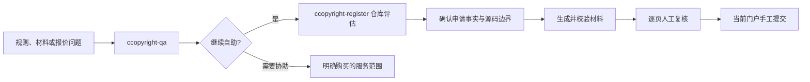

<div align="center">

# 中国软件著作权自助工具集

> **先把规则问明白，再把材料做扎实。**

[](https://agentskills.io)
[](README.en.md)
[](#安全与边界)

分不清一条说法是不是官方要求，不知道代理费具体买到了什么，<br>
或者已经有了代码，却还没理清源码、说明书和申请信息该怎么对应？

[两个 Skill 怎么选](#两个-skill怎么选) · [一分钟安装](#一分钟安装) · [第一次使用](#第一次使用) · [实际会怎么走](#实际会怎么走) · [安全与边界](#安全与边界)

**普通交存** · **人工提交** · **隐私优先** · **不提供法律结论**

</div>

---

## 初衷

办理软著时，真正费时间的往往不是找一份模板，而是判断一条说法究竟来自法规、办事指南、登录后的门户，还是服务商自己的包装。等到开始准备材料，又会遇到另一组问题：哪些代码适合放进去，说明书里的功能有没有仓库证据，哪些申请信息必须由本人确认。

所以我们把这件事拆成两个 Skill：`ccopyright-qa` 负责把问题讲明白，`ccopyright-register` 负责把已经确认的事实和真实代码整理成材料。你可以只装其中一个，也可以先问清楚，再决定要不要继续自己准备。

第三方服务当然可能有价值。整理材料、撰写文案、排版、代录入和人工沟通都需要成本。这里不替你判断一项服务“值不值”，只把官方要求、自己能做的事、服务商实际交付的内容和需要专业判断的部分分开说清楚。

两个 Skill 都只做到向[中国版权保护中心](https://www.ccopyright.com.cn/)提交之前：不登录账号，不自动填写或提交网页，也不跟踪申请或解析补正通知。

## 两个 Skill，怎么选

| | **ccopyright-qa** | **ccopyright-register** |
|---|---|---|
| 适合 | 规则、字段、材料、自助可行性、脱敏报价 | 仓库评估、事实底稿、源码/文档材料、PDF 校验 |
| 怎么工作 | 只读回答，说明来源、日期、条件与未核实之处 | 先只读评估，经你同意后再写入 `.ccopyright/` |
| 会写文件吗 | 不会 | 会，但只写材料工作区，不静默修改业务源码 |
| 本地依赖 | 普通使用无需 Python、Chrome 或 Poppler | Python 必需；PDF 流程需要 Chrome 与 Poppler |
| 典型开口 | “软件简称可以不填吗？”“我一定要找代理吗？” | “评估这个仓库”“生成源码、说明书和 PDF” |

如果还拿不准，按下面选就行：

- **只想先把问题问明白**：安装 **ccopyright-qa**。
- **已经要处理代码仓库**：安装 **ccopyright-register**。
- **还不确定从哪里开始**：两个一起安装，先问 QA。

## 一分钟安装

### 推荐：一次安装两个 Skill

```bash
npx skills add OtterPaw-Studio/ccopyright-skill \
  --skill ccopyright-qa ccopyright-register
```

### 只安装一个

```bash
# 只读答疑
npx skills add OtterPaw-Studio/ccopyright-skill --skill ccopyright-qa

# 材料准备
npx skills add OtterPaw-Studio/ccopyright-skill --skill ccopyright-register
```

### 全局安装到 Codex

```bash
npx skills add OtterPaw-Studio/ccopyright-skill \
  --skill ccopyright-qa ccopyright-register \
  --agent codex \
  --global
```

已经克隆本仓库时，也可以从当前目录安装：

```bash
npx skills add . --skill ccopyright-qa ccopyright-register
```

**skills** CLI 可以直接通过 **npx** 运行。安装、更新、卸载和匿名安装统计见 [skills.sh CLI 文档](https://www.skills.sh/docs/cli)。如需关闭某次安装的遥测：

```bash
DISABLE_TELEMETRY=1 npx skills add OtterPaw-Studio/ccopyright-skill \
  --skill ccopyright-qa ccopyright-register
```

## 第一次使用

安装后直接用自然语言说需求。下面几段可以原样复制，也可以按自己的情况改。

### 先问规则，不生成文件

```text
使用 $ccopyright-qa 告诉我申请普通软件著作权通常需要哪些材料。
请区分官方法规基线、当前门户仍需核对的事项，以及我可以自行完成的工作。
```

### 先评估仓库，不生成材料

```text
使用 $ccopyright-register 评估这个仓库是否适合准备普通软著登记。
先不要生成材料，请列出建议的软件身份、源码边界、缺失事实和全部警告。
```

### 直接开始草稿

```text
使用 $ccopyright-register 为这个仓库准备软著登记材料。
先说明写入范围，再创建 .ccopyright 工作区并生成草稿；
只询问代码无法安全确定的事实。
```

### 拆解一份服务报价

```text
使用 $ccopyright-qa 拆解下面这份已经删除身份、订单和支付信息的服务报价。
告诉我每项交付物、我仍需完成的工作，以及需要向服务商问清楚的问题。
```

面向登记提交的填写底稿和鉴别材料默认使用中文。

## 前置依赖

| 依赖 | **ccopyright-qa** | **ccopyright-register** |
|---|:---:|:---:|
| 支持 Agent Skills 的 AI Agent | 必须 | 必须 |
| 带 **npx** 的 Node.js | 仅安装时 | 仅安装时 |
| 访问当前官方页面 | 涉及时效问题时 | 确认当前门户要求时 |
| Python 3.10+，命令名为 **python** | 不需要 | 必须 |
| Chrome 或 Chromium | 不需要 | 生成 PDF 时 |
| Poppler | 不需要 | 校验 PDF、生成接触表时 |
| Git | 不需要 | 推荐但非必须 |

答疑 Skill 不要求代码仓库、门户账号或本地生成工具。材料准备 Skill 缺少 PDF 工具时，仍能扫描仓库并生成事实底稿、Markdown 和 HTML。

可以让 **ccopyright-register** 执行环境预检，也可以在它的安装目录运行：

```bash
python scripts/ccopyright.py preflight
```

本地生成器不额外需要 LLM API Key、门户密码、身份证明或签名证书。

## 实际会怎么走



| 阶段 | 你要做的事 | 会留下什么 |
|---|---|---|
| 先问清楚 | 提出规则、字段、材料或报价问题 | 有依据的回答、尚未核实的地方和下一步建议 |
| 看仓库 | 指定准备登记的代码仓库 | 源码/文档清单、候选边界、证据映射和 **INFO/WARNING** 预检 |
| 补事实 | 确认代码无法证明的申请信息 | `facts/application.json` 事实底稿和待确认清单 |
| 做材料 | 确认源码顺序和说明书内容 | 填写底稿、程序/文档鉴别材料、证明清单和追溯记录 |
| 做校验 | 核对当前门户要求并完成必要确认 | A4 PDF、分页/哈希/字段校验、逐页图片和接触表 |
| 最后复核 | 逐页检查最终内容 | 不覆盖旧内容的 `ready-to-submit` 时间戳版本 |

### 材料工作区

**ccopyright-register** 默认在目标软件仓库中创建：

```text
.ccopyright/
├── facts/                 唯一申请事实和规则快照
├── reports/               仓库清单、预检、证据、构建和渲染报告
├── drafts/                可复制填写底稿与人工清单
├── work/                  Markdown、HTML、PDF、图片和追溯清单
├── qa/                    校验报告、逐页图片与接触表
└── ready-to-submit/       不覆盖旧内容的时间戳复核版本
```

程序鉴别材料由显式选择的第一方文件组成，保留原始空行、注释、制表符和顺序；每个打印行都能映射回原路径、原行号、源码流位置和哈希。文档鉴别材料只使用申请人确认的文档、仓库证据和真实产品截图，证据不足时给出警告，不虚构功能。

完整指南：[材料准备](skills/ccopyright-register/README.md) · [只读答疑](skills/ccopyright-qa/README.md)

## 来源、报价与不确定性

**ccopyright-qa** 会区分四类依据：

1. 官方法律、条例或规章；
2. 中国版权保护中心的具体办事指南或 FAQ，并标明访问日期；
3. 本次申请中明确核对的当前门户脱敏文字；
4. 只能证明第三方自身说法的材料，或明确标注的推断与实践建议。

费用、入口、字段、上传限制、办理时限和服务商价格都会变化，不能拿旧记忆当现状。找不到能支撑结论的当前来源时，回答会直接写明“未核验”。

你提供的报价只用来分析这一单，不会被当成当前市场价。项目也不会脱离服务范围和证据，直接把某个价格说成“合理”“不合理”或“骗局”；它只负责把官方事项、自己要做的事、服务商交付和承诺条件逐项拆开。

`ccopyright-register` 里保存了一份可更新的门户兼容性配置，用来检查字段、条件分支和字数。它不是答疑依据，也不能代替当前门户。

## 安全与边界

两个 Skill 都不会：

- 自动填写或提交浏览器表单；
- 登录、签字、缴费或操作申请人账号；
- 跟踪申请或解析补正通知；
- 判断权属、合同效力或保证登记通过；
- 保存证件号码、证件扫描件、签名、账号凭据、支付信息或会话数据；
- 自动处理例外交存、封存、涉密或军用流程。

**ccopyright-qa** 默认只读，不扫描仓库、不生成文件；**ccopyright-register** 会先说明准备写到哪里，得到同意后才使用 `.ccopyright/`，也不会悄悄改动业务源码。它们只帮你理解规则、准备材料，不构成法律意见。

仓库、权属和知识产权预检只有 **INFO** 与 **WARNING**，只是提醒你复核，不作法律结论。如果当前门户字段、必填事实、普通交存选择或 PDF 校验还有问题，最终生成会停下来等你处理。

## 管理已安装的 Skill

```bash
# 查看
npx skills list
npx skills list --global

# 更新
npx skills update ccopyright-qa ccopyright-register

# 卸载
npx skills remove ccopyright-qa ccopyright-register
```

## 常见问题

### 我应该先安装哪个 Skill？

只想了解规则或判断是否需要服务，安装 **ccopyright-qa**；已经要处理代码仓库，安装 **ccopyright-register**；不确定时两个一起安装。

### 答疑结果一定是最新的吗？

不一定。法规可能修订，办事页面和登录后的门户也会变化。涉及当前费用、表单、入口、时限或上传限制时，需要重新核对具体官方页面和本次门户；内置校验配置不能替代这一步。

### 没有 Chrome 或 Poppler 能生成材料吗？

可以生成仓库评估、事实底稿、追溯清单、Markdown 和 HTML；PDF 渲染与技术校验需要相应工具。

### 每个 WARNING 都必须消除吗？

不需要。仓库、权属和知识产权预检警告只用于复核，不阻断草稿；当前门户限制、这次申请涉及的证明、必填事实、普通交存选择和 PDF 校验问题可能挡住最终生成。

## 官方参考

- [QA 官方页面来源目录](skills/ccopyright-qa/references/zh-CN/official-sources.md)
- [中国版权保护中心软件登记指南](https://www.ccopyright.com.cn/index.php?optionid=1030)
- [《计算机软件著作权登记办法》](https://www.ncac.gov.cn/xxfb/flfg/bmgz/202410/t20241015_869486.html)
- [《计算机软件保护条例》现行整合文本](https://xzfg.moj.gov.cn/mobile/law/detail?LawID=581)
- [skills.sh 文档](https://www.skills.sh/docs)

维护者与贡献者命令见 [AGENTS.md](AGENTS.md)。
